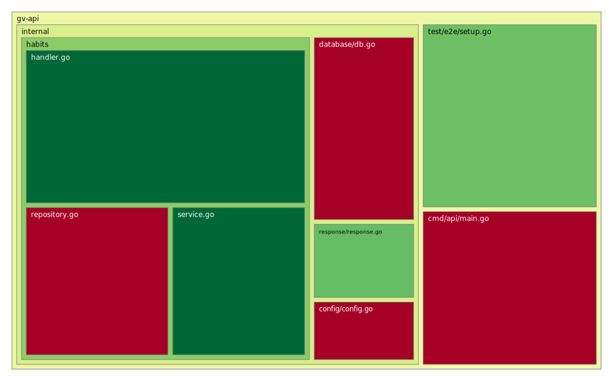

# gv-api

Un orquestador de vida integral desarrollado en Go, diseñado para centralizar datos de múltiples servicios web, plataformas y dispositivos.

## Coverage




## Tecnologías

- **Go:** Core del sistema.
- **`go-chi/chi/v5`:** Router ligero e idiomático.
- **`pgx/v5` & `sqlc`:** Interacción con PostgreSQL eficiente y generación automática de código.
- **PostgreSQL:** Almacenamiento relacional de métricas y configuraciones.

## Instalación y Configuración

### Requisitos
- Git, Docker & Docker Compose
- Go (v1.25.6+)
- sqlc

### Pasos iniciales

1. **Clonar y configurar:**
   ```bash
   git clone [https://github.com/OscarCarPu/gv-api.git](https://github.com/OscarCarPu/gv-api.git)
   cd gv-api
   make setup-project
